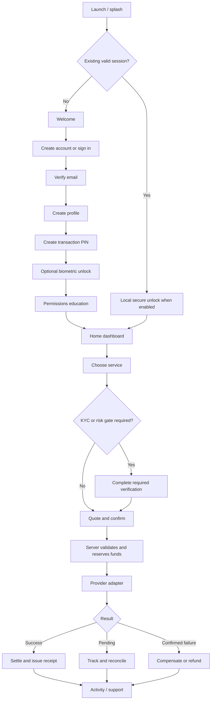

# Billy Mobile App Implementation Plan

## Objective

Build the complete Android and iOS application, database model, provider boundaries, operational tooling, and test flows before live provider credentials are available. Provider-backed features stay disabled or tester-only until the relevant account, approval, keys, webhook configuration, and live verification are complete.

This is a mobile implementation, not a copy of the FirstOption website/WhatsApp experience or the Active Store website. Those projects provide verified service behavior and provider lessons only.

The read-only production behavior mapping is recorded in
[`FIRSTOPTION_PRODUCTION_SERVICE_MAP.md`](./FIRSTOPTION_PRODUCTION_SERVICE_MAP.md).
It informs service semantics only; Billy's visual design and interaction system
remain independent.

## Bulk Build Sequence

1. **Foundation and brand** — Billy design system, logo assets, navigation shell, animation language, secure configuration, and reusable mobile components.
2. **Auth and onboarding** — splash, welcome, registration, verification, sign-in/recovery, profile setup, transaction PIN, biometrics, and protected routes.
3. **Financial core** — profiles, RLS, wallet ledger, reservations, idempotent transactions, receipts, activity, and mock funding/KYC.
4. **Main product experience** — dashboard, wallet actions, services, cards, notifications, account/security, support, empty/loading/error states, and feature flags.
5. **Financial service flows** — PocketFi funding, VTpass bills, Prestmit gift cards and prepaid cards, Quidax crypto, and Prembly KYC, completed against Billy-owned mocks and adapters.
6. **Additional service flows** — foreign SMS numbers and social media boosting, including ordering, pending states, cancellation/refund, history, and reconciliation.
7. **Provider activation and hardening** — add credentials only when approved, verify live contracts, run bounded end-to-end checks, then enable testers and production progressively.

## Product Scope

### Financial services inherited from FirstOption

| Capability | Intended provider boundary | Pre-credential state |
|---|---|---|
| Wallet funding | PocketFi | Build virtual-account adapter, callback flow, ledger settlement, fixtures, and sandbox UI; keep live funding off |
| KYC | Prembly | Build verification contract, consent screens, status model, mock responses, and service gating; keep verification off |
| Bills | VTpass | Build dynamic catalog, validation, purchase, status, and reconciliation adapters using sanitized fixtures |
| Gift cards | Prestmit | Build dynamic products/rates, ungated browsing/buying, KYC-gated selling, quotes, evidence upload, payout, and status flows; tester-only |
| Crypto | Quidax | Build KYC-gated Buy, Sell, Receive, and Send flows with runtime asset/network catalogs, quotes, addresses, risk notices, and status tracking; off |
| Virtual/prepaid cards | Prestmit Prepaid Cards | Build runtime product selection, amount/range validation, creation-fee quote, wallet purchase, secure delivery, and pending fulfilment; no KYC gate |

Prestmit Prepaid Cards and Quidax are not assumed production-ready merely because reference code exists. Their capabilities must be reconfirmed from current provider documentation and dashboard access.

### Services inherited from Active Store

| Capability | Intended provider boundary | Pre-credential state |
|---|---|---|
| Foreign SMS numbers | DaisySMS and TextVerified for US inventory; SMS-Activate and PVACodes for international inventory | Build normalized catalog/order/status/cancel/refund contracts with mock adapters; off |
| Social media boosting | The Lord of the Panels SMM API | Build catalog sync, quote, order, status, refill/cancel, refund, and admin controls with fixtures; off |

Provider names remain server/admin details. Customer-facing screens use neutral labels such as `US Numbers`, `International Numbers`, and `Social Boost`.

## Target Customer Flow

## Onboarding and Authentication

### First launch

1. Branded splash using the Billy mark.
2. Branded welcome screen with the Billy wordmark centered and clear `Create account` and `Sign in` actions.
3. On first account creation, show a three-page introduction focused on paying, trading, and managing services in one place. Always provide `Skip`; returning users can go directly to registration.
4. Terms, privacy policy, age confirmation, and regulated-service notice before account creation.

### Initial authentication method

- Start with Supabase email/password plus email verification because it does not depend on an unapproved phone/SMS provider.
- Implement deep-link handling with PKCE for verification, password reset, and future OAuth callbacks.
- Require approved HTTPS Terms and Privacy Policy URLs plus immutable version identifiers in production. Record the versions declared at signup in an immutable, owner-readable acceptance record.
- Collect a phone number as profile data, but do not claim it is verified until a real verification channel is configured.
- Build Google and Apple sign-in behind disabled feature flags. Apple sign-in must be available when another third-party social sign-in is offered on iOS.
- Build phone OTP as an adapter-ready future option, not as the initial dependency.
- Treat biometric unlock as local access to an existing session, never as identity verification or transaction authorization by itself.

### Post-registration onboarding

1. Verify email.
2. Capture legal first/last name, display name, country, phone number, and date of birth only where required by the service/compliance model.
3. Create a six-digit transaction PIN atomically with onboarding progress. HMAC-pepper it with a Supabase Vault secret before bcrypt hashing; never store or log the PIN. Any later money-authorization verifier must remain server-side and add recent-auth checks, online rate limits, lockouts, and auditable attempts.
4. Offer Face ID, Touch ID, or Android biometrics for local app unlock.
5. Explain notifications, then request permission only when the user opts in.
6. Show a short dashboard tour and land on Home.
7. Defer full KYC until the user enters a capability that requires it, while displaying their verification level clearly.

### Returning-user and recovery flows

- Session restoration with a branded loading state and safe timeout.
- Sign in, sign out, password reset, email-change confirmation, and account recovery.
- Reauthentication before changing a PIN, revealing card details, withdrawing, changing security settings, or performing another sensitive action.
- Rate limits, progressive delays, and auditable lockouts for repeated PIN/auth failures.
- Device/session list and remote sign-out in a later security milestone.
- Account deletion must be a reviewed workflow that handles balances, pending transactions, legal retention, and token revocation; never a direct client-side user deletion.

## Mobile Information Architecture

### Primary tabs

1. **Home** — greeting, notification entry, wallet balance, add/withdraw actions, quick services, banner, recent activity.
2. **Activity** — unified transactions and service orders with filters, details, receipts, retry-safe status refresh, and support entry.
3. **Cards** — Prestmit prepaid-card products, purchase orders, securely
   delivered details, fulfilment history, and empty/disabled states. Reloading
   or freeze controls appear only if the live provider contract supports them.
4. **Services** — full catalog, rates where relevant, availability, search, favorites, and maintenance states.
5. **Account** — profile, KYC, security, beneficiaries, notification settings, legal documents, support, and sign out.

### Home quick actions

- Pay Bills
- Gift Cards
- Crypto
- Foreign Numbers
- Social Boost
- More

Unavailable services remain visible only when there is a useful explanation or waitlist action. Otherwise, feature flags remove them from navigation entirely.

## Application Architecture

### Mobile

- Expo Router route groups: `(public)`, `(onboarding)`, `(app)`, and modal routes.
- Feature folders for `auth`, `wallet`, `bills`, `gift-cards`, `crypto`, `cards`, `sms`, `social-boost`, `activity`, and `account`.
- A typed Supabase client and generated database types.
- TanStack Query or an equivalent single server-state layer for caching, invalidation, polling, and offline-aware retries.
- Secure session persistence using platform secure storage; ordinary preferences may use non-sensitive storage.
- React Hook Form plus a shared schema-validation layer for all forms.
- A design-token layer rather than screen-specific colors and spacing.
- Error boundaries, network/offline states, skeletons, empty states, and accessibility labels from the beginning.

### Backend

- Supabase Auth for identity and sessions.
- Postgres as the financial source of record.
- RLS on every exposed table, ownership predicates for user rows, and private schemas for provider/admin internals.
- Edge Functions for provider calls, secrets, callbacks, privileged operations, quotes, and transaction orchestration.
- Storage buckets with explicit policies for avatars, KYC evidence, gift-card evidence, and receipts as applicable.
- Realtime only where it improves a live order experience; polling/reconciliation remains available as a fallback.
- Cron jobs for pending-order reconciliation, expired SMS cancellation/refund, provider catalog refresh, and stale reservation cleanup.

### Provider boundary

Every provider implements a typed adapter with:

- configuration validation and health check;
- dynamic catalog/rate retrieval;
- quote or price calculation;
- create/order action with an idempotency key;
- normalized status lookup;
- cancellation/refund support where available;
- webhook signature verification and normalized callback handling;
- sanitized observability; and
- fixture-driven contract tests.

The mobile app never calls a provider directly. Feature services call a Billy server endpoint, which applies auth, ownership, limits, pricing, ledger rules, and the configured adapter.

## Core Data Model

The exact migration is designed and reviewed during implementation. Expected domains are:

- `profiles`, `user_preferences`, `user_security_settings`
- `wallets`, `wallet_ledger`, `balance_reservations`
- `transactions`, `transaction_events`, `receipts`
- `kyc_profiles`, `kyc_checks`, `consents`
- `beneficiaries`
- `feature_flags`, `service_availability`
- private provider configuration, provider requests, webhook events, and reconciliation runs
- `bill_orders`
- `gift_card_orders` and evidence
- `crypto_orders` and address/network records
- `card_accounts`, `cards`, and card transactions
- `sms_orders` and received-message events
- `boost_services`, `boost_orders`, and boost-order events
- `notifications`, `support_cases`, and audit events

Money is stored as integer minor units. Wallet writes occur through narrowly scoped server-side functions that atomically create ledger entries and enforce idempotency.

## Build-Without-Credentials Strategy

For each integration:

1. Write the Billy domain contract and normalized statuses.
2. Build a deterministic mock adapter with success, pending, timeout, insufficient-provider-balance, invalid-input, duplicate, and confirmed-failure scenarios.
3. Create sanitized catalog and webhook fixtures based on current official documentation or verified reference behavior.
4. Build Edge Function orchestration against the adapter interface.
5. Build the complete mobile flow against the mock environment.
6. Add contract, idempotency, ownership/RLS, compensation, and reconciliation tests.
7. Add `off`, `testers`, and `all` rollout modes.
8. Create an admin diagnostics surface that reports configuration presence and health without revealing secrets.
9. Keep the live adapter disabled until the activation checklist passes.

Mocks must never fabricate undocumented production capabilities. Unknown behavior remains an explicit open item for provider confirmation.

## Provider Activation Checklist

Each provider receives a tracked readiness record:

- legal/commercial approval complete;
- dashboard owner and backup owner recorded;
- sandbox and production base URLs confirmed;
- sandbox and production credentials received through an approved secret channel;
- required source IPs, callback URLs, redirect URLs, and app identifiers configured;
- webhook signing method and retry behavior confirmed;
- account prefunding/balance requirements understood;
- catalog, limits, rate limits, currencies, fees, and settlement behavior confirmed live;
- support/escalation contact recorded;
- Supabase secrets set without exposing values to Git or mobile builds;
- read-only health and catalog call passes;
- sandbox happy path, failure path, duplicate request, timeout, webhook replay, and reconciliation tests pass;
- production smoke test uses a bounded amount and an approved tester;
- financial and provider results reconcile;
- feature advances from `off` to `testers`, then to `all` only after review.

## Delivery Phases

### Phase 0 — Foundation and brand

- Replace the starter experience with Billy route groups, design tokens, typography, icons, and reusable mobile primitives.
- Prepare production logo exports, splash, adaptive Android icon, monochrome icon, iOS icon, and notification icon.
- Add environment validation, typed configuration, secure session storage, testing framework, CI, error reporting boundary, and feature-flag client.

**Exit:** clean launch on Android and iOS, branded shell, tests/CI green, no sensitive values in the bundle.

### Phase 1 — Auth and onboarding

- Implement the complete onboarding, email/password auth, verification deep links, password recovery, profile setup, transaction PIN, biometric opt-in, session restoration, and protected navigation.
- Create profile/security migrations and RLS tests.

**Exit:** new and returning users can complete every auth/recovery path; users cannot read or modify another user's records.

### Phase 2 — Wallet and financial core

- Implement wallet display, immutable ledger, reservations, idempotent transaction engine, funding/withdrawal placeholders, receipts, activity timeline, and admin reconciliation primitives.
- Build PocketFi and Prembly adapter contracts with mocks.

**Exit:** concurrent and retried mock transactions cannot double-spend, double-credit, or produce an unexplained balance.

### Phase 3 — Dashboard and service shell

- Implement the supplied dashboard direction, quick actions, unified activity, notifications, service availability, maintenance states, account/security, support, and KYC gates.
- Add analytics events without PII or secrets.

**Exit:** the entire app navigation and every service entry/disabled state works with realistic test data.

### Phase 4 — Bills

- Implement VTpass catalog, customer validation, quote/fees, confirmation, PIN authorization, provider order, pending state, receipt, webhook/status reconciliation, and compensation.

**Exit:** all documented mock and sandbox scenarios pass; live mode remains off until activation.

### Phase 5 — Gift cards and crypto

- Implement Prestmit buy/sell flows, product/rate retrieval, evidence upload, review states, settlement, and disputes.
- Implement Quidax asset/network discovery, quotes, warnings, addresses/requests, status tracking, and compliance gates.

**Exit:** dynamic catalogs and complete mocked order lifecycles pass without hardcoded provider inventory.

### Phase 6 — Prepaid virtual cards

- Implement the active Prestmit prepaid-card purchase model: runtime USD/CAD
  Visa and Mastercard products, allowed amount ranges, a server-authoritative
  quote including the creation fee, wallet/PIN purchase, secure card-detail
  delivery, pending fulfilment, and order history.
- Do not inherit legacy Sudo reload, freeze/unfreeze, or KYC behavior. Add a
  lifecycle action only if the current Prestmit dashboard/API proves it.

**Exit:** sensitive card data never enters logs or insecure storage; unavailable/live states are explicit.

### Phase 7 — Foreign numbers and social boost

- Implement normalized US/international number catalogs, purchase, countdown, message receipt, cancellation rules, expiry, auto-refund, and history across the four SMS adapters.
- Implement SMM catalog sync, platform/service selection, dynamic fields, quote, order, progress, refill/cancel eligibility, refunds, and history.

**Exit:** provider-specific differences stay inside adapters; expired/failed orders reconcile without manual wallet edits.

### Phase 8 — Operations and launch hardening

- Admin configuration/health, rollout controls, order search, reconciliation, manual-review queues, audit records, provider-balance alerts, and support tooling.
- Threat review, RLS/advisor review, load/concurrency tests, offline and slow-network tests, deep-link tests, accessibility, device matrix, privacy/legal copy, app-store assets, and staged release.

**Exit:** approved launch checklist, tester rollout, monitored production smoke tests, and documented rollback/disable procedures.

## Decisions Required Before Deep Implementation

These do not block the foundation but must be decided before their relevant phase:

- launch countries and currencies;
- legal entity, privacy policy, terms, age limit, and compliance obligations;
- whether email/password is accepted as the initial sign-in method;
- KYC tiers and which services/limits each tier unlocks;
- wallet funding and withdrawal rules, fees, limits, and settlement times;
- whether crypto is custodial, conversion-only, or routed to an external flow;
- virtual-card product scope and supported currencies;
- customer-support channel and service-level expectations;
- analytics/crash-reporting vendor;
- exact app-store display name, bundle identifiers, and domain for deep links.

## Recommended First Implementation Slice

Start with Phase 0 and Phase 1 only:

1. lock the design tokens and production-ready logo exports;
2. create the route groups and secure Supabase client;
3. create profile/security migrations with RLS tests;
4. implement email auth, deep links, session restoration, profile setup, transaction PIN, and biometrics;
5. finish with a realistic, non-functional dashboard shell using mock wallet and service availability data.

This produces a reviewable mobile foundation without prematurely designing financial tables around unconfirmed provider behavior.
